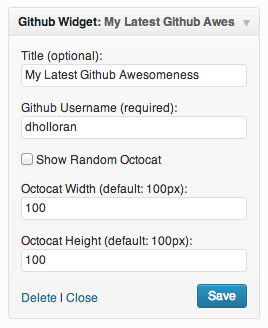

#WP Multi File Uploader

**Description:** Wordpress widget that grabs a random Octocat from the octodex and the latest commit from the master branch of a public GitHub repository

**Plugin Home Page:** not approved

**Thanks to:** If your project is included and I do not have you added please let me know, thank you.

If you have any issues please submit an [issue](https://github.com/DHolloran/wp-github-recent-commit/issues/new) or fix it/submit a pull request I will try to handle it ASAP. You an also contact me at [Dan@danholloran.com](mailto:dan@danholloran.com).

##Screenshots
  

##Getting Started
To get started with WP Github Recent Commit you can download it directly [here](https://github.com/DHolloran/wp-github-recent-commit/archive/master.zip), search for WP Github Recent Commit in your administrator section's Plugins > Add New, or you can download it from the [Wordpress plugins directory](#) (not approved).

###Wordpress Plugin Directory Instructions
1. Search for WP Github Recent Commit in Plugins > Add New
2. Install &amp; Activate WP Github Recent Commit
3. Go to Appearance > Widgets drag the WP Github Recent Commit widget to the sidebar area of your choice
4. Fill in your GitHub username

###Manual Install Instructions
1. Unzip your download and place in wp-content/plugins/
2. Activate WP Github Recent Commit in the Wordpress Admin area
3. Go to Appearance > Widgets drag the WP Github Recent Commit widget to the sidebar area of your choice
4. Fill in your GitHub username